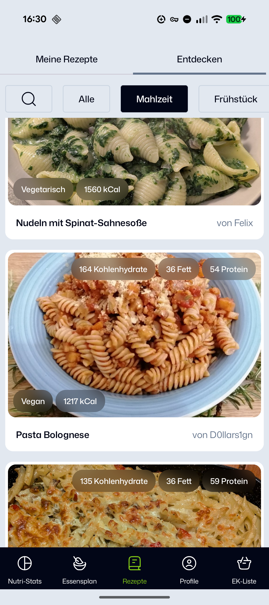
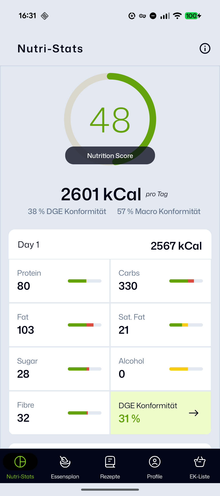
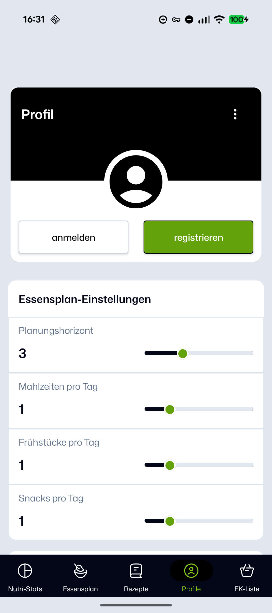

# <Mealplanner>

An Android app for planning meals and discovering new recipes. 
It helps users discover get an overview of the nutritional value of planed meal and allows for automatic creation of a shopping list.  
Own recipes can also be created and published (to the backend).  
The translation into both supported languages(EN/DE) and the calculation of the macronutrients  will happen automatically on publish. 

---
## Getting Started

The app can be installed directly from the [Google Play Store](<link>).

---

## Screenshots
| Discover Recipes | Nutrition Stats | Settings |
|------|---------|----------|
|  |  |  |

---

## Tech Stack
**Language:** Kotlin  
**UI:** <Jetpack Compose>
**Architecture:** MVVM  Architecture (View → ViewModel → UseCase → Repository → DAO)  
**Async / State:** Coroutines, Flow  
**DI:** <Hilt>  
**Networking / Serialization:** <Retrofit, OkHttp, Moshi, Kotlinx Serialization>  
**Persistence:** <Room>
**Navigation:** <Navigation Compose>
**Image Loading:** Coil  
**Google Services:** Firebase (<Crashlytics>)  
